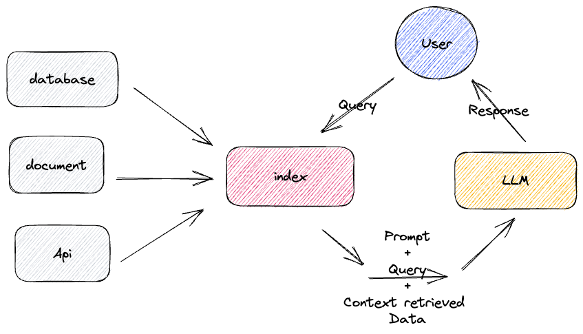

# How to install and setup the project

## Install llamaindex

```bash
poetry add llama-index
```

## Install pytorch

```bash
poetry add 'transformers[torch]'
```

## Install pithon dot env

```bash
poetry add python-dotenv
```

## Add chroma db (A vector database for fast similarity search)
  
```bash
poetry add chromadb
```

## Add lanchain 

```bash
poetry add lanchain
```

## Add langchain-community
  
  ```bash
  poetry add langchain-community
  ```

## Retrieved Augmentad Generation (RAG) model


